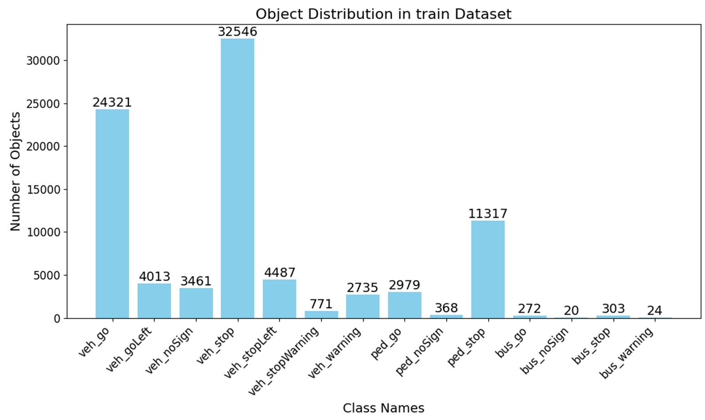
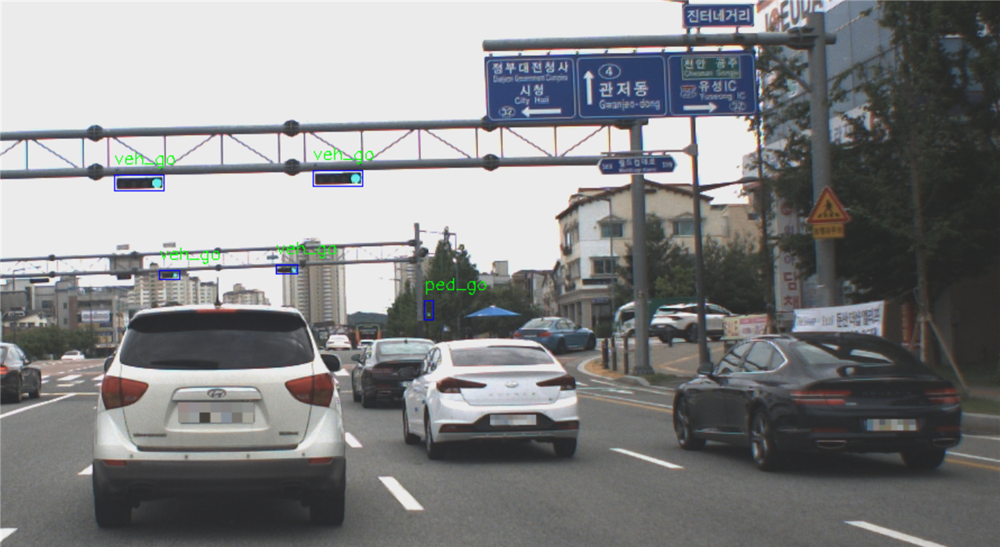
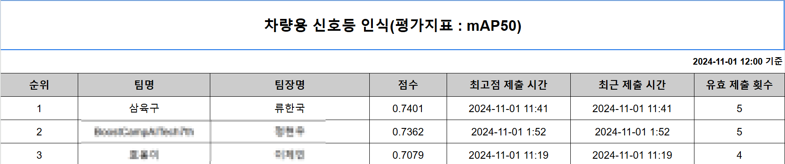
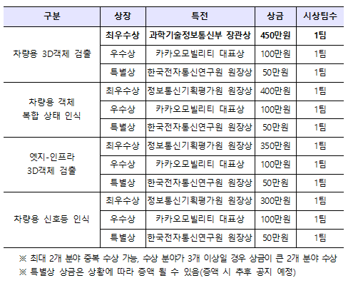

# 2024년 자율주행 인공지능 챌린지

## 프로젝트 소개
주행환경에서 카메라 센서를 이용하여 신호등 인식
- 데이터셋 설명
  - 학습 : 26,864장, 테스트 : 13,505장
  - 클래스 종류 : 신호등 유형 14가지
  
  - 데이터 샘플 
    
-  평가 방법
   -   COCO 평가 지표에서 IoU (Intersection over Union) 0.5를 사용해 평가를 진행하며, 순위는 mAP50으로 산정 

## 프로젝트 일정
- 10/02 00:00 ~ 11/01 12:00

## 프로젝트 수행
- EDA : 클래스 불균형 확인, 경계박스 비율 확인
- Baseline code, 사용할 라이브러리 선택 : MMDetection, YOLO
- train/validation 나누기 : 
  - k=3의 Out-of-fold (OOF) 전략을 선택. 총 세 개의 학습-검증 데이터셋을 만듦. 세 개의 검증 데이터셋은 각각 학습 데이터셋의 10%, 10% 5%로 구성
  - train dataset의 비슷한 주행 환경에서의 이미지가 100~200 프레임으로 연속됨을 확인
  - 전체 학습 데이터를 100구간으로 나눈 뒤 그 중 랜덤으로 36구간을 검증 데이터셋의 후보군으로 선정
  - 12구간씩 36 구간을 각각의 검증데이터셋의 후보군으로 다시 나눔. 
  - 각 검증데이터셋은 12구간의 후보군 중에서 연속된 이미지를 검증 데이터셋으로 취함

- 오프라인 데이터 증강: Albumentation의 FDA,HueSaturationValue, RGBShift, GaussianBlur 을 사용하여 학습 데이터의 5% 증강.
- 다양한 모형 실험 : 
  - Cascade convnext(mmdetection)
  - DINO_swin(mmdetection) 
  - Co-DETR(mmdetection) 
  - YOLO5
  - YOLO10
  - YOLO11
- Weighted Boxes Fusion : 앙상블 기법으로 WBF 사용

## 프로젝트 결과
- 차량용 신호등인식 분야 1등 (최우수상, 정보통신기획평가원 원장상) 

## Manual Report

- manual_korean.pdf: 사용법 및 세부사항

| File(.py)                         | Description                                                   |
| --------------------------------- | ------------------------------------------------------------- |
| split_3_dataset_traffic_light     | Out-Of-Fold로 train/valid 분할                                |
| data_augmentation                 | 데이터에 오프라인으로 데이터증강 적용                         |
| yolo2coco_train_val_traffic_light | mmdetection의 모델 훈련을 위한 coco포맷의 train/val.json 생성 |
| yolo2coco_test_traffic_light      | mmdetection의 모델 훈련을 위한 coco포맷의 test.json 생성      |
| ensemble                          | Weighted Boxes Fusion 코드                                    |
| pkl2txt_traffic_light             | yolo 포맷의 txt 결과 파일 생성                                |
| visualization.ipynb               | 시각화 코드                                                   |
| export_result_detect              | yolo모델의 결과 추론 코드                                     |